# Mockups and Text Wireframes

## Timeline card (mobile)
[ CD14 ] Green background (fertile)
Sensation: Wet
Appearance: Clear
Quantity: Medium
Banner: "High fertility signs"

Peak is only highlighted after P+3 confirmed.

## Daily Entry screen
- Bleeding: dropdown (heavy/moderate/light/spotting/none)
- Sensation: radio (dry/damp/wet/slippery)
- Appearance: radio (none/cloudy/clear/stretchy)
- Quantity: dropdown (none/low/medium/high)
- Intercourse: toggle (yes/no)
- Notes: text
- Save validates ESQ combos (e.g., no slippery + dry mismatch)

## Understanding Your Chart

Place screenshot images in `docs/images/` with the filenames below so they render here and live in version control.

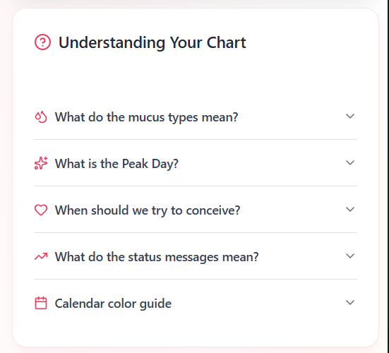

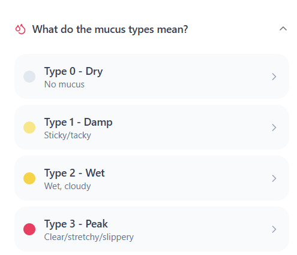

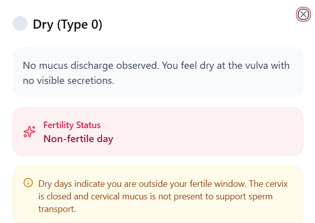

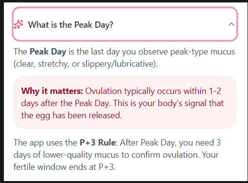

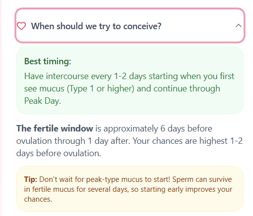

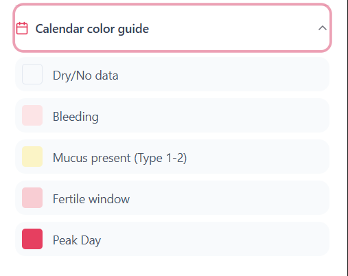

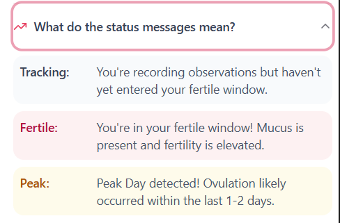

## Calendar and New Entry (Calendar View)

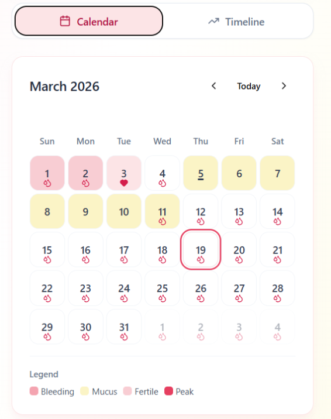

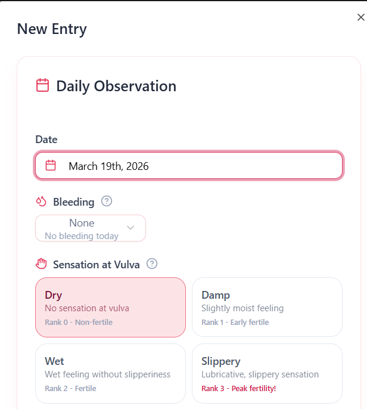

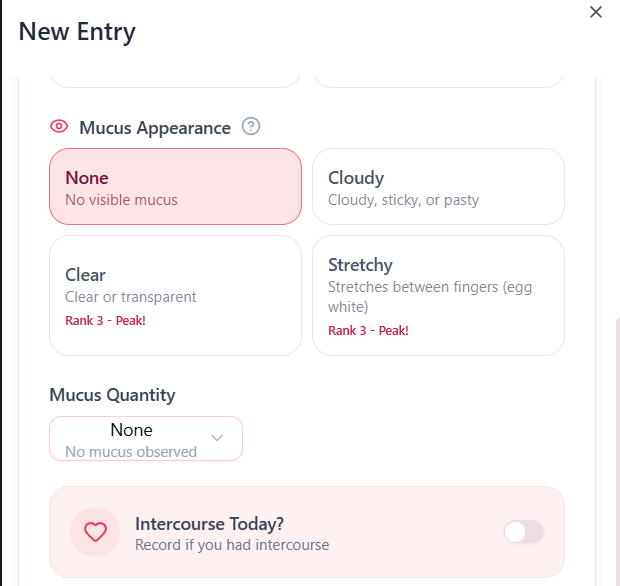

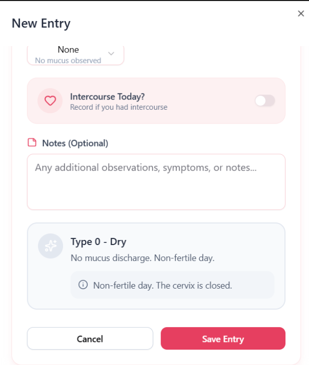

## App Overview

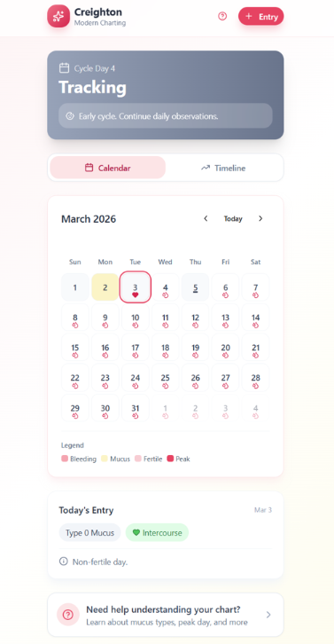
